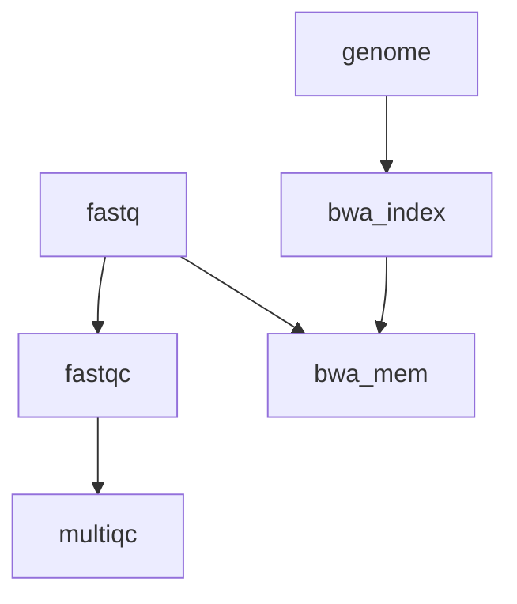

# Marine Omics Variant Pipeline

Designed to process data from raw reads through to vcf. 



# Quick Start

1. Install [nextflow](https://www.nextflow.io/)
2. Run a test to make sure everything is installed properly. The command below should work on a linux machine with singularity installed (eg JCU HPC). 
```bash
nextflow run marine-omics/movp -latest -profile singularity,test -r main
```
If you are working from a mac or windows machine you will need to use docker. 
```bash
nextflow run marine-omics/movp -latest -profile docker,test -r main
```
3. Create the sample csv file

Example (single end reads)
```
sample,fastq_1
1,sample1.fastq.gz
2,sample2.fastq.gz
```

Example (paired-end reads)
```
sample,fastq_1,fastq_2
1,sample1_r1.fastq.gz,sample1_r2.fastq.gz
2,sample2_r1.fastq.gz,sample2_r2.fastq.gz
```

4. Choose a profile for your execution environment. This depends on where you are running your code. `movp` comes with preconfigured profiles that should work on JCU infrastructure. These are
	- *HPC* (ie zodiac) : Use `-profile zodiac`
	- *genomics12* (non stan) : Use `-profile genomics`
If you need to customise further you can create your own `custom.config` file and invoke with option `-c custom.config`


```bash
nextflow run marine-omics/movp -profile docker,test -r main
```

Paths should either be given as absolute paths or relative to the launch directory (where you invoked the nextflow command)
