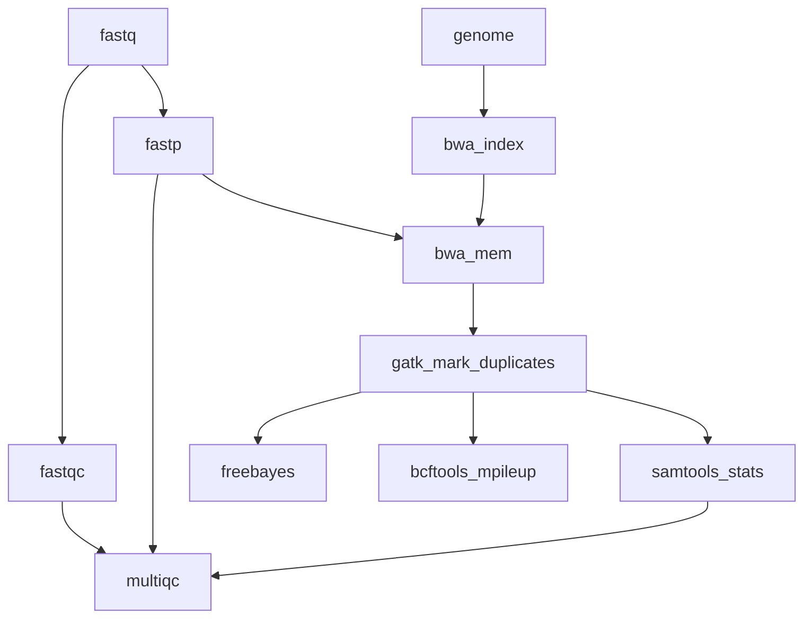

# Marine Omics Variant Pipeline


Designed to process data from raw reads through to vcf. Adjusted for AIMS HPC



## Quick Start

1. Install [nextflow](https://www.nextflow.io/). If working on the AIMS HPC, Nextflow is already installed as a module (as of March 2025). Current version: 23.10.0 build 5889, created 15-10-2023 15:07 UTC. Use `module load nextflow` to be able to use it.
2. Download docker image and convert to singularity (see below)
3. Run a test to make sure everything is installed properly. The command below should work on a linux machine with singularity installed (eg AIMS/JCU HPC). 
```bash
nextflow run marine-omics/movp -latest -profile singularity,test -r main
```
4. Create the sample csv file (example below)
```
sample,fastq_1,fastq_2
1,sample1_r1.fastq.gz,sample1_r2.fastq.gz
2,sample2_r1.fastq.gz,sample2_r2.fastq.gz
```
Paths should either be given as absolute paths or relative to the launch directory (where you invoked the nextflow command)

**LORENZO <- need to check and test correct profile for AIMS HPC**

5. Choose a profile for your execution environment. This depends on where you are running your code. `movp` comes with preconfigured profiles that should work on JCU infrastructure and pawsey/setonix. These are
	- *JCU HPC* (ie zodiac) : Use `-profile zodiac`
	- *genomics12* (HPC nodes without pbs): Use `-profile genomics`
	- *setonix*: Use `-profile setonix` and set your slurm account with `--slurm_account pawseyXXXX`

If you need to customise further you can create your own `custom.config` file and invoke with option `-c custom.config`. See [nextflow.config](nextflow.config) for ideas on what parameters can be set.

6. Run the workflow with your genome and samples file
```bash
nextflow run marine-omics/movp -profile singularity,zodiac -r main --genome <genomefile> --samples <samples.csv> --outdir myoutputs
```

## Detailed instructions

### Download docker image and convert to singularity

When running for the first time nextflow will need to download the docker image from dockerhub and convert it to a singularity image. This can be slow, and nextflow doesn't make it easy to monitor progress.  If this step is failing you can try downloading the image separately yourself. 

First make sure you set your `NXF_SINGULARITY_CACHEDIR` variable to a path where you can permanently store the singularity images required by `movp`. For example to put it `.nxf/singularity_cache` in your home directory you would do;
```bash
mkdir ${HOME}/.nxf/singularity_cache
export NXF_SINGULARITY_CACHEDIR=${HOME}/.nxf/singularity_cache
```

This will create the directory and set the value of `NXF_SINGULARITY_CACHEDIR` for your current login session. To make this setting permanent you should add the export command shown above to your `.bash_profile`. Note that this will work only on login nodes, if you want it to work from compute nodes (e.g., you are submitting a job to pull the singularity image) you will need to add the `export` command above tot he `.bashrc` file.

Next pull the image from dockerhub. This command will download the image, convert to singularity format and place it in your previously defined `NXF_SINGULARITY_CACHEDIR`.  Note that this command is specific for container version `0.4`. 
```bash
module load singularity

singularity pull  --name ${NXF_SINGULARITY_CACHEDIR}/iracooke-movp-0.4.img docker://iracooke/movp:0.4
```

This step took me ~3-4 minutes on the AIMS HPC (March 2025). To ensure the image was downloaded properly, run a test command

```bash
nextflow run marine-omics/movp -latest -profile singularity,test -r main
```

### Prepare input csv file of sample names and fastq filenames

Note, you do not need to produced this manually, and it can often be faster and more accurate to use a script. Here I provide an example on how to do so, but the exact command will change based on your filenames. If you find a very different usecase that you think might be useful for others, feel free to add here with a commit.

My filenames are in the format `sampleName_L[1-4]_[1-2].fq.gz`, where `sampleName` contains metadata fields separated by `-` (e.g., `PROJECT-SUBPROJECT-YEAR-Sspecies-SITENAME-SAMPLEID`), `L[1-4]` denotes the lane that particular library was run on (e.g., `L1` was run on lane 1 of the flowcell), `[1-2]` denotes whether it is a forward or reverse read (`1` = forward, `2` =  reverse). Forward and reverse reads are often denoted as `R[1-2]`, so if that's the case for you adjust the script accordingly.

```bash
# create empty sample.csv files with headers only
echo "sample,fastq_1,fastq_2" > samples.csv

# loop over files in directory of fastq files (note, it will include all samples in the directory, adjust if needed)
for sample in $(ls samples/dir/ | sed 's/_.*//g' | sort -u); do

	# create variables for the forward and reverse reads
	# note, I include the absolute path within the AIMS HPC
	# if you want you can simply have the sample names (you'll need to run this script from the directory where the fq files are found)
	file1=$(ls ${HOME}/samples/dir/${sample}_L*_1.fq.gz)
	file2=$(ls ${HOME}/samples/dir/${sample}_L*_2.fq.gz)

	# append one row per unique sample name
	echo "${sample},${file1},${file2}" >> samples.csv
```

### Customising resource usage

The default resource limits for individual processes are often going to need tweaking for individidual projects. This can be done fairly easily by creating a custom config file. 


For example, if you want to increase memory and cpu requests for the `bwa_mem_gatk` and `gatk_mark_duplicates` steps you would create a custom config as follows
```
process {
	withName: 'bwa_mem_gatk'{
		cpus=12
		memory=10.GB
	}
	withName: 'gatk_mark_duplicates'{
		cpus=12
		memory=30.GB
	}
}
```
Save this into a file called `local.config` and then run tell nextflow to use it with the `-c` option as follows

```bash
nextflow run marine-omics/movp -latest -profile singularity,zodiac -r main <genomefile> --samples <samples.csv> --outdir myoutputs -c local.config
```

When running on the JCU HPC jobs will be submitted to the queuing system, which is PBS Pro. Options available to set are described [here](https://www.nextflow.io/docs/latest/executor.html#pbs-pro). 


### Running in the background

If your workflow will take a long time you may want to run it in the background. This will ensure that the workflow continues even if you logout.  To do this simply add the `-bg` option. Once the workflow is running in the background you can check progress using
```bash

```

