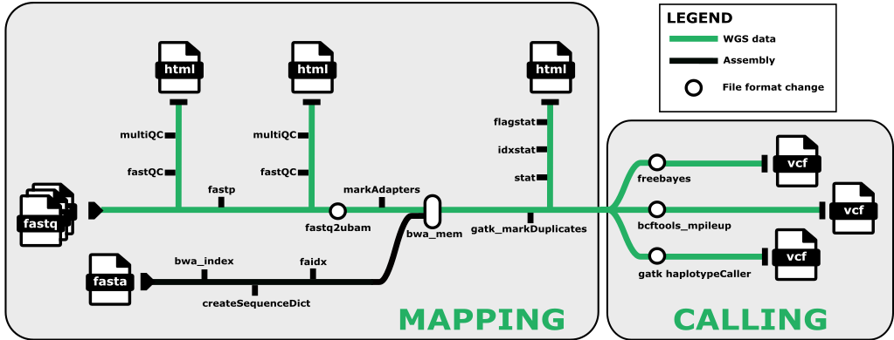

# Marine Omics Variant Pipeline


Designed to process data from raw reads through to vcf. 



# Quick Start

1. Install [nextflow](https://www.nextflow.io/). If working on JCU infrastructure [please see these detailed instructions](https://gist.github.com/iracooke/bec2b24a86eb682f7d3055eea15e61aa)
2. Run a test to make sure everything is installed properly. The command below should work on a linux machine with singularity installed (eg JCU HPC). 
```bash
nextflow run marine-omics/movp -latest -profile singularity,test -r main
```
If you are working from a mac or windows machine you will need to use docker. 
```bash
nextflow run marine-omics/movp -latest -profile docker,test -r main
```
3. Create the sample csv file (example below)
```
sample,fastq_1,fastq_2
1,sample1_r1.fastq.gz,sample1_r2.fastq.gz
2,sample2_r1.fastq.gz,sample2_r2.fastq.gz
```

Paths should either be given as absolute paths or relative to the launch directory (where you invoked the nextflow command)

4. Choose a profile for your execution environment. This depends on where you are running your code. `movp` comes with preconfigured profiles that should work on JCU infrastructure and pawsey/setonix. These are
	- *JCU HPC* (ie zodiac) : Use `-profile zodiac`
	- *genomics12* (HPC nodes without pbs): Use `-profile genomics`
	- *setonix*: Use `-profile setonix` and set your slurm account with `--slurm_account pawseyXXXX`

If you need to customise further you can create your own `custom.config` file and invoke with option `-c custom.config`. See [nextflow.config](nextflow.config) for ideas on what parameters can be set.

5. Run the workflow with your genome and samples file
```bash
nextflow run marine-omics/movp -profile singularity,zodiac -r main --genome <genomefile> --samples <samples.csv> --outdir myoutputs
```

# Alternative way to run the workflow

Instead of running the entire workflow from start to finish it is often better to break it into steps.  This provides more ability to troubleshoot problems with data and also reduces the total number of inodes used by the workflow. 

Use the `--nocall` option to run only the preprocessing steps.  This produces mapped bam files with duplicates marked.  These are ready for analysis with many other workflows and tools such as ANGSD or popoolation. 

```
nextflow run marine-omics/movp -latest -profile docker,test -r main --nocall
```

After running this step you can then collect the bam files in the output of this step.  Let's say those are collected into the `out` directory. Make a bams input file as in the following example

```
sample,bam
1,out/mapped_marked_bams/1_marked.bam
2,out/mapped_marked_bams/2_marked.bam
```

If this file is bams.csv

```
nextflow run marine-omics/movp -latest -profile docker,test -r main --bams bams.csv
```

# Installing Nextflow on a system with an old java version.

Our JCU HPC systems are still running java 8 but nextflow requires 11 or newer. One way around this is to use [sdkman](https://sdkman.io/) to install and manage a different java version. This is now the preferred way to install java for nextflow ([See instructions here](https://www.nextflow.io/docs/latest/install.html#install-page). 


# Troubleshooting

### Docker image

When running for the first time nextflow will need to download the docker image from dockerhub and convert it to a singularity image. This can be slow, and nextflow doesn't make it easy to monitor progress.  If this step is failing you can try downloading the image separately yourself. 

First make sure you set your `NXF_SINGULARITY_CACHEDIR` variable to a path where you can permanently store the singularity images required by `movp`. For example to put it `.nxf/singularity_cache` in your home directory you would do;
```bash
mkdir ~/.nxf/singularity_cache
export NXF_SINGULARITY_CACHEDIR=${HOME}/.nxf/singularity_cache
```
This will create the directory and set the value of `NXF_SINGULARITY_CACHEDIR` for your current login session. To make this setting permanent you should add the export command shown above to your `.bash_profile` 

Next pull the image from dockerhub. This command will download the image, convert to singularity format and place it in your previously defined `NXF_SINGULARITY_CACHEDIR`.  Note that this command is specific for container version `0.4`. 
```bash
singularity pull  --name ${NXF_SINGULARITY_CACHEDIR}/iracooke-movp-0.4.img docker://iracooke/movp:0.4
```

### Customising resource usage

The default resource limits for individual processes are often going to need tweaking for individidual projects. This can be done fairly easily by creating a custom config file. 


For example, if you want to increase memory and cpu requests for the `bwa_mem_gatk` and `gatk_mark_duplicates` steps you would create a custom config as follows
```
process {
	withName: 'bwa_mem_gatk'{
		cpus=12
		memory=10.GB
	}
	withName: 'gatk_mark_duplicates'{
		cpus=12
		memory=30.GB
	}
}
```
Save this into a file called `local.config` and then run tell nextflow to use it with the `-c` option as follows

```bash
nextflow run marine-omics/movp -latest -profile singularity,zodiac -r main <genomefile> --samples <samples.csv> --outdir myoutputs -c local.config
```

When running on the JCU HPC jobs will be submitted to the queuing system, which is PBS Pro. Options available to set are described [here](https://www.nextflow.io/docs/latest/executor.html#pbs-pro). 


### Running in the background

If your workflow will take a long time you may want to run it in the background. This will ensure that the workflow continues even if you logout.  To do this simply add the `-bg` option. Once the workflow is running in the background you can check progress using
```bash

```

