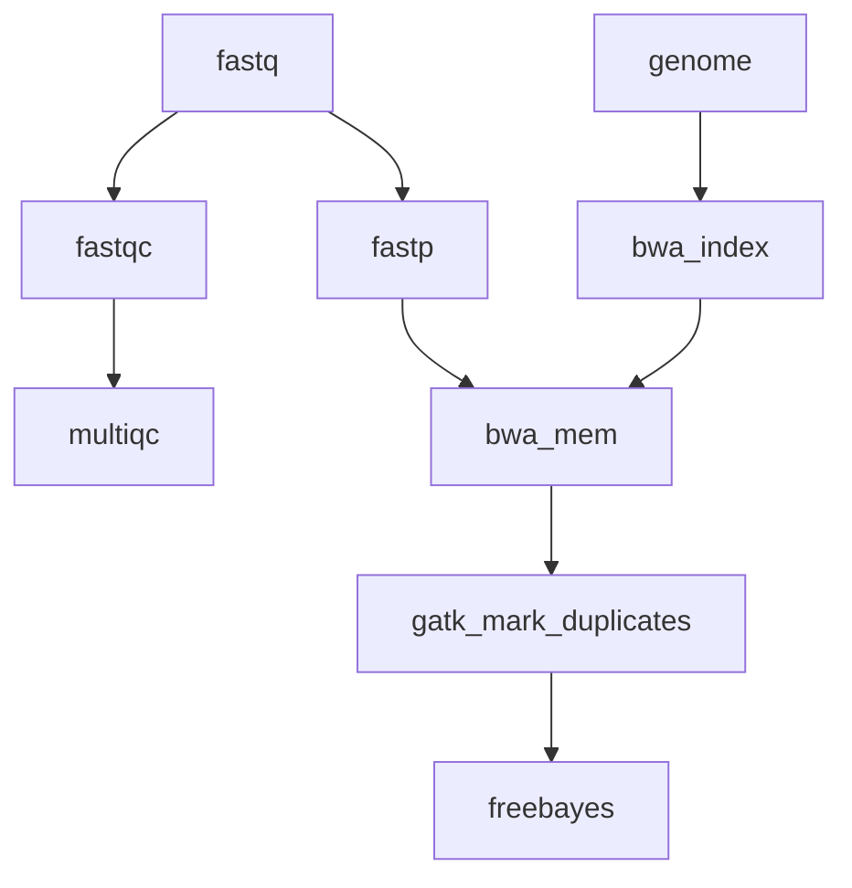

# Marine Omics Variant Pipeline


Designed to process data from raw reads through to vcf. 



# Quick Start

1. Install [nextflow](https://www.nextflow.io/)
2. Run a test to make sure everything is installed properly. The command below should work on a linux machine with singularity installed (eg JCU HPC). 
```bash
nextflow run marine-omics/movp -latest -profile singularity,test -r main
```
If you are working from a mac or windows machine you will need to use docker. 
```bash
nextflow run marine-omics/movp -latest -profile docker,test -r main
```
3. Create the sample csv file (example below)
```
sample,fastq_1,fastq_2
1,sample1_r1.fastq.gz,sample1_r2.fastq.gz
2,sample2_r1.fastq.gz,sample2_r2.fastq.gz
```

Paths should either be given as absolute paths or relative to the launch directory (where you invoked the nextflow command)

4. Choose a profile for your execution environment. This depends on where you are running your code. `movp` comes with preconfigured profiles that should work on JCU infrastructure. These are
	- *HPC* (ie zodiac) : Use `-profile zodiac`
	- *genomics12* (HPC nodes without pbs): Use `-profile genomics`

If you need to customise further you can create your own `custom.config` file and invoke with option `-c custom.config`. See [nextflow.config](nextflow.config) for ideas on what parameters can be set.

5. Run the workflow with your genome and samples file
```bash
nextflow run marine-omics/movp -profile singularity -r main --genome <genomefile> --samples <samples.csv>
```

# Troubleshooting

When running for the first time nextflow will need to download the docker image from dockerhub and convert it to a singularity image. This can be slow, and nextflow doesn't make it easy to monitor progress.  If this step is failing you can try downloading the image separately yourself. 

First make sure you set your `NXF_SINGULARITY_CACHEDIR` variable to a path where you can permanently store the singularity images required by `movp`. For example to put it `.nxf/singularity_cache` in your home directory you would do;
```bash
mkdir ~/.nxf/singularity_cache
export NXF_SINGULARITY_CACHEDIR=${HOME}/.nxf/singularity_cache
```
This will create the directory and set the value of `NXF_SINGULARITY_CACHEDIR` for your current login session. To make this setting permanent you should add the export command shown above to your `.bash_profile` 

Next pull the image from dockerhub. This command will download the image, convert to singularity format and place it in your previously defined `NXF_SINGULARITY_CACHEDIR`.  Note that this command is specific for container version `0.3`. 
```bash
singularity pull  --name ${NXF_SINGULARITY_CACHEDIR}/iracooke-movp-0.3.img docker://iracooke/movp:0.3
```


